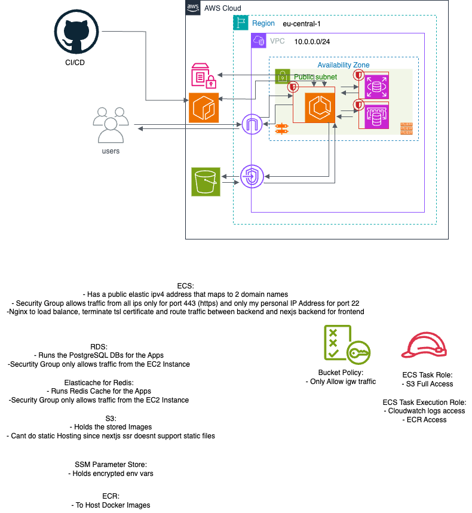

# Farid Mohseni | Developer Portfolio

Hi, I'm Farid Mohseni, a Fullstack Developer focused on developing scalable, type-safe, and high-performance web applications. My expertise lies in creating Applications that use React/Next.js at the frontend and robust Node.js/Express backends. I build systems with a strong emphasis on data integrity, security, and automated CI/CD workflows.

My experince ranges from designing robust REST APIs and real-time communication with WebSockets to automating the Workflow with GitHub Actions and bundling the application with Docker.

This repository contains the codebase for my personal portfolio, built with React, Vite, and Tailwind CSS.

---

## Featured Projects

### shoppi

A E-Commerce-App featuring JWT Auth, OAuth, Admin Dashboard and CRUD features for Products and Orders as well as checkout flow through Stripe for authenticated Users. Infrastructure provisioned through Terraform on AWS.



**Tech Stack:**

- Terraform
- AWS
- TypeScript
- React
- NextJs
- TailwindCSS
- NodeJs
- Express
- PostgreSQL
- PrismaORM
- Redis
- Stripe
- Docker
- npm workspaces
- Github Actions
- Vitest
- Cronjob
- Multer
- OAuth
- JWT
- Mailjet

**Highlights:**

- Monorepo Architecture
- Docker Implementation
- JWT and OAuth
- Admin CRUD and Dashboard
- Rate Limiting and Cloudflare Turnstile
- Multi Currency Support through Maxmind IP Mapping
- Cronjobs
- EMail Verification
- Cloud Hosting
- Terraform Porvisioning
- Multi Device Support
- Stripe Integration
- Protected Routes thorugh Authenticationa and Authorization Status
- Data Integrity through Transactions on the Database level
- Better SEO through NextJs Frontend
- Automated Testing and Deployment through Github Actions

---

### HoopTracker

A basketball-focused web app designed for tracking players and matches.

**Tech Stack & APIs:**

- **React**
- **NextJs**
- **Tailwind CSS**
- **Framer Motion**
- **ShadCN**
- **OpenAI**
- **SportsData.io**

**Highlights:**

- **NBA Statistics**
- **AI-Chatbot**

---

### Friendly. (Social Media Clone)

A Fullstack Social Media Clone with Session based Authentication focusing on CRUD features and a livechat through Websockets.

**Tech Stack:**

- **React**
- **Typescript**
- **Vite**
- **Tailwind CSS**
- **Framer Motion**
- **React-Hook-Form & Zod**
- **Tanstack-Query**
- **React-Router**
- **Zustand**
- **Klipy GIF API**
- **NodeJs**
- **Express**
- **PrismaORM**
- **Redis**
- **PassportJs**
- **Socket.io**
- **Mailjet**
- **Cloudinary**
- **Multer**

**Highlights:**

- Responsive Design
- Session based Authentication
- CRUD Functionality (Like,Follow,Unfollow,Post,Post Feed,Edit Account)
- Email Verification
- File Upload and Cloud Storage
- GIF Support
- Real-Time Chat

---

### Wise (Git Clone)

A Git Clone written in Go and Cobra

**Tech Stack:**

**Go (Golang)**
**Cobra Framework**

**Highlights:**

**Parallel Hashing:** Implements a **Fan-Out** pattern with semaphores (limited to 100 concurrent operations) to hash large projects without hitting OS file descriptor limits.
**Streaming History:** Utilizes a **Producer-Consumer** model for repository logging, allowing the CLI to stream and print commit records immediately via channels.
**Hybrid Concurrency:** Employs performance thresholds to switch between simple loops and concurrent workers based on repository size, ensuring zero overhead for small projects while maintaining speed for large ones.
**Thread-Safe Caching:** Features `sync.Map` for caching `CommitRecord` objects during deep history traversals to drastically reduce redundant disk I/O.
**Content-Addressable Storage:** Efficiently deduplicates data by only writing to the `objects` directory when file content has actually changed.
**Robust Branch Management:** Safely handles creating, switching, and deleting branches, including prompts to protect uncommitted local changes.
**GoDoc Compliant:** The entire `utils` package follows standard Go documentation conventions for maximum maintainability and navigation.

---

## Commands

| Command | Action | Description |
| :--- | :--- | :--- |
| `init` | **Initialize** | Creates `.wise` directory, object storage, and sets up the `main` branch. |
| `commit` | **Snapshot** | Captures the current directory state using parallel hashing and parent pointers. |
| `log` | **History** | `-a` for full history streaming; `-c` to check for uncommitted changes. |
| `branch` | **Manage** | Lists, creates (`-c`), switches (`-s`), or deletes (`-d`) local branches. |
| `restore` | **Revert** | Restores the working directory to the exact state of a specific commit hash. |

---

## Project Structure

```text
.wise/
├── HEAD                # Pointer to the active branch
├── objects/            # Database of blobs and commit records
└── refs/
    └── heads/
        └── [branch]    # Files containing the active commit hash
.wiseignore
